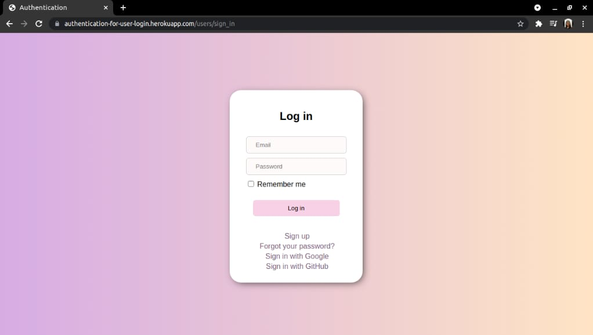
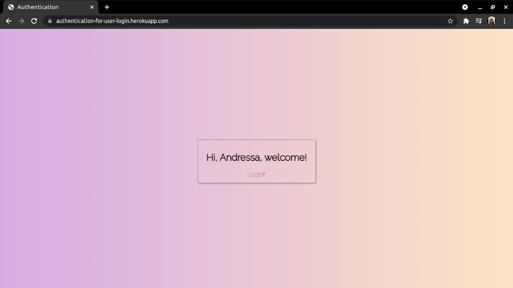

<h1 align="center">Authentication For User Login</h1>

<h2>Project status:</h2>🚀 Finished 🚧

## Description:

User login authentication project and interface via GitHub and Google. This project was
developed using the gems:

## Technologies:
  * Gems: devise, omniauth-github, omniauth, google-oauth2
  * Ruby on Rails
  * PostgreSQL
  * SQLite

## Login Interface 

  

## Welcome

  

## Deploy:
Project link: https://authentication-for-user-login.herokuapp.com/users/sign_in

## Features:
- [x] Initialize database
- [x] Create authentication with GitHub
- [x] Create authentication with Google
- [x] Create login interface
- [x] Create welcome interface

Exercise proposed by the company Real Seguro Viagem -> https://www.seguroviagem.srv.br/  
